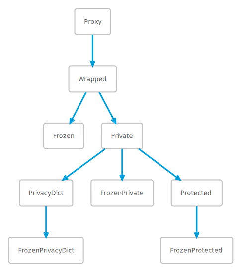

# pyprotect: Restrict visibility or mutability of Python object attributes
pyprotect is a python module that provides API to restrict visibility or mutability of selected Python object attributes in a robust manner.

The key functions in the pyprotect module API - __private()__ and __protect()__ wrap the python object (like a _Proxy_) to restrict visibility or mutability of selected attributes of the wrapped object, while allowing the __wrapping__ object to behave virtually identical to the __wrapped__ object.

## Features
- Can wrap virtually any Python object - instances, classes (types), modules, methods, classmethods, instancemethods, staticmethods, partials, lambdas.
- Tested on Python 2.7.18 and Python 3.6.9, 3.7.5, 3.8.0, 3.10.6. Should work on any version of Python3.
- Has extensive unit (functional) tests - in _tests_ directory.

## Table of Contents

<!-- vim-markdown-toc GFM -->

* [Protect attributes in any python object instance (or class)](#protect-attributes-in-any-python-object-instance-or-class)
* [VISIBILITY versus READABILITY or ACCESSIBILITY](#visibility-versus-readability-or-accessibility)
    * [VISIBILITY: appears in dir(object)](#visibility-appears-in-dirobject)
    * [READABILITY or ACCESSIBILITY: Accessing the VALUE of the attribute](#readability-or-accessibility-accessing-the-value-of-the-attribute)
* [MUTABILITY: Ability to CHANGE or DELETE an attribute](#mutability-ability-to-change-or-delete-an-attribute)
* [Classes](#classes)
* [FUNCTIONS](#functions)
        * [contains(p: object, o: object):](#containsp-object-o-object)
        * [freeze(o: object) -> object:](#freezeo-object---object)
        * [help_protected(o: object) -> None:](#help_protectedo-object---none)
        * [id_protected(o: object) -> int:](#id_protectedo-object---int)
        * [immutable_builtin_attributes() -> Set[str]:](#immutable_builtin_attributes---setstr)
        * [isfrozen(o: object) -> bool:](#isfrozeno-object---bool)
        * [isimmutable(o: object) -> bool:](#isimmutableo-object---bool)
        * [isinstance_protected(o: object, c: type) -> bool:](#isinstance_protectedo-object-c-type---bool)
        * [isprivate(o: object) -> bool:](#isprivateo-object---bool)
        * [isprotected(o: object) -> bool:](#isprotectedo-object---bool)
        * [isreadonly(o: object, a: str) -> bool:](#isreadonlyo-object-a-str---bool)
        * [iswrapped(o: object) -> bool:](#iswrappedo-object---bool)
        * [private(o: object, frozen: bool = False) -> object:](#privateo-object-frozen-bool--false---object)
        * [protect(o: object frozen: bool = False, dynamic: bool = True, hide_private: bool = False, ro_data: bool = False, ro_method: bool = True, ro: List[str] = [], rw: List[str] = [], hide: List[str] = []](#protecto-object-frozen-bool--false-dynamic-bool--true-hide_private-bool--false-ro_data-bool--false-ro_method-bool--true-ro-liststr---rw-liststr---hide-liststr--)
        * [wrap(o: object) -> object:](#wrapo-object---object)
* [Usage](#usage)
* [Options: protect method arguments](#options-protect-method-arguments)
* [Readability and mutability of attributes with protect() method](#readability-and-mutability-of-attributes-with-protect-method)
* [Python rules for attributes of type 'property':](#python-rules-for-attributes-of-type-property)
* [What kind of python objects can be wrapped?](#what-kind-of-python-objects-can-be-wrapped)
* [Why can't I subclass Protected class?](#why-cant-i-subclass-protected-class)
* [How do I](#how-do-i)
    * [Make my object completely read-only](#make-my-object-completely-read-only)
    * [Completely hide private variables hat are normally read-only, but visible](#completely-hide-private-variables-hat-are-normally-read-only-but-visible)
* [Work in progress](#work-in-progress)
* [Changelog](#changelog)
    * [Dec-08-2022](#dec-08-2022)

<!-- vim-markdown-toc -->

## Quick start
```python

freeze(o: object) -> Frozen:
```

```python
private(o: object, frozen: bool = False) -> object:
```
Returns: __FrozenPrivate__ instance if _frozen_; __Private__ instance otherwise
    
```python
protect(o: object frozen: bool = False, dynamic: bool = True, hide_private: bool = False, ro_data: bool = False, ro_method: bool = True, ro: List[str] = [], rw: List[str] = [], hide: List[str] = []
    o-->object to be wrapped
    frozen-->bool: No attribute can be modified. Default: False
    dynamic-->bool: Attribute additions, deletions, type changes in wrapped
        object are automatically visible
        Default: True   
    hide_private-->bool: Private vars (_var) will be hidden. Default: False
    ro_data-->bool: Data attributes will be read-only. Default: False
    ro_method-->bool: Method attributes will be read-only. Default: True    
    ro-->list of str: attributes that will be read-only. Default: []
    rw-->list of str: attributes that will be read-write. Default: []
        Overrides 'ro_*'    
    hide-->list of str: attributes that will be hidden. Default: []
```
Returns-->Instance of __FrozenProtected__ if _frozen_; Instance of __Protected__ otherwise

### Options: protect method arguments

| Option            | Type        | Default  | Description | Overrides |
| ----------------- | ----------- | -------- | ----------- | --------- |
| frozen            | bool        | False    | <ul><li>If True, no attributes can be CHANGED or ADDED</li></ul> |
| hide_private      | bool        | False    | <ul><li>Private vars (form _var) will be hidden</li></ul> | |
| ro_data           | bool        | False    | <ul><li>Data (non-method) attributes will be read-only</li><li>Override selectively with 'rw'</li></ul> | |
| ro_method     | bool    | True | <ul><li>Method attributes will be read-only</li><li>Override selectively with 'rw'</li></ul> | |
| ro                | list of str | [ ]   | <ul><li>Attributes that will be read-only</li><li>Can selectively override with 'rw'</li></ul> | |
| rw                | list of str | [ ]   | <ul><li>Attributes that will be read-write</li></ul> | ro_data<br>ro_method<br>ro |
| hide              | list of str | [ ]   | <ul><li>Attributes that will be hidden</li></ul> | |


## Classes



## Features of key classes
### Frozen
Frozen object prevents modification of ANY attribute
- Does not additionally restrict visibility of any attributes in __wrapped__ object accessed through __wrapping__ object

### Private
- Cannot access traditionally 'private' mangled python attributes
- Cannot modify traditionally private attributes (form '_var')
- Cannot add or delete attributes
- Cannot modify CLASS (```__class__```)of wrapped object
- Cannot modify ```__dict__``` of wrapped object
- Cannot modify ```__slots__``` of wrapped object
- The following attributes of wrapped object are NEVER writeable:
    ```'__dict__', '__delattr__', '__setattr__', '__slots__', '__getattribute__'```
- Traditional (mangled) Python private vars are ALWAYS hidden
- Private vars (form \_var) will be read-only
- Attributes cannot be added or removed
- Attributes not part of dir(wrapped_object) are not visible
- Attributes that are properties are ALWAYS visible AND WRITABLE (except if '_frozen_' is used)
    - Properties indicate an intention of class author to expose them
    - Whether they are actually writable depends on whether class author implemented property.setter
### FrozenPrivate
- Features of Private PLUS prevents modification of ANY attribute
### Protected
- Features of Private PLUS allows __further restriction__ of:
    - Which attributes are VISIBLE
    - Which attributes are WRITEABLE
Default settings:
- Features of Private - see above
- dynamic == True
    Attribute additions, deletions, type changes automatically visible
- ro_method == True: Method attributes will be read-only
- All other non-private data attributes are read-write

#### Readability and mutability of attributes with protect() method
| Option        | Attribute Type    | Restricts Readability | Restricts Mutability     |
| ------------- | ----------------- | ----------- | -------------- |
| frozen        | Any               | NO          | YES            |
| hide_private  | Private attributes | YES         | YES (Indirect) |
| ro_data       | Data attributes   | NO          | YES            |
| ro_method     | Method attributes | NO          | YES            |
| ro            | ANY               | NO          | YES            |
| rw            | ANY               | NO          | YES            |
| hide          | ANY               | YES         | YES (Indirect) |
| show          | ANY               | YES         | NO             |

### FrozenProtected
- Features of Protected PLUS prevents modification of ANY attribute
### FrozenPrivacyDict
abc


## FUNCTIONS
#### contains(p: object, o: object):
    Returns--whether 'p' wraps 'o'

#### freeze(o: object) -> object:
    Frozen object prevents modification of ANY attribute
        - Does not hide traditionally 'private' mangled python attributes

#### help_protected(o: object) -> None:
    help for wrapped object if wrapped; help for 'o' otherwise

#### id_protected(o: object) -> int:
    id of wrapped object if wrapped; id of 'o' otherwise

#### immutable_builtin_attributes() -> Set[str]:
    Returns-->set of str: attributes in builtins that are immutable
    Used in unit tests

#### isfrozen(o: object) -> bool:
    'o' was created using freeze()

#### isimmutable(o: object) -> bool:
    'o' is KNOWN to be immutable

#### isinstance_protected(o: object, c: type) -> bool:
    Returns-->True IFF isinstance(object_wrapped_by_o, c)
    Similar to isinstance, but object o can be an object returned
    by freeze(), private() or protect()

#### isprivate(o: object) -> bool:
    'o' was created using private()

#### isprotected(o: object) -> bool:
    'o' was created using protect()

#### isreadonly(o: object, a: str) -> bool:
    Returns-->bool: True IFF 'o' is wrapped AND 'o' makes arribute 'a'
        read-only if present in wrapped object
    This represents RULE of wrapped object - does not guarantee
    that WRAPPED OBJECT has attribute 'a' or that setting attribute
    'a' in object 'o' will not raise any exception

#### iswrapped(o: object) -> bool:
    'o' was created using wrap / freeze / private / protect
 
#### wrap(o: object) -> object:
Returns: Wrapped
- Should behave just like the wrapped object, except following attributes cannot be modified:
    '\_\_getattribute\_\_', '\_\_delattr\_\_', '\_\_setattr\_\_', '\_\_slots\_\_',
- Does NOT protect CLASS of wrapped object from modification
- Does NOT protect \_\_dict\_\_ or \_\_slots\_\_
    
Useful for testing if wrapping is failing for a particular type of object


## Usage
```python
# Use any custom class of your own
class MyClass(object):
    def __init__(self):
        self.__hidden = 1
        self._private = 2
        self.public = 3


# Get an instance of your class
myinst = MyClass()

# import + ONE line to wrap and protect class attributes
from pyprotect import protect
wrapped = protect(myinst)
```

## Options: protect method arguments

| Option            | Type        | Default  | Description | Overrides |
| ----------------- | ----------- | -------- | ----------- | --------- |
| frozen            | bool        | False    | <ul><li>If True, no attributes can be CHANGED or ADDED</li></ul> |  | |
| hide_private      | bool        | False    | <ul><li>Private vars (form _var) will be hidden</li></ul> | |
| ro_data           | bool        | False    | <ul><li>Data (non-method) attributes will be read-only</li><li>Override selectively with 'rw'</li></ul> | |
| ro_method     | bool    | True | <ul><li>Method attributes will be read-only</li><li>Override selectively with 'rw'</li></ul> | |
| ro                | list of str | [ ]   | <ul><li>Attributes that will be read-only</li><li>Can selectively override with 'rw'</li></ul> | |
| rw                | list of str | [ ]   | <ul><li>Attributes that will be read-write</li></ul> | <li>ro_data</li><li>ro_method</li><li>ro</li></ul> |
| hide              | list of str | [ ]   | <ul><li>Attributes that will be hidden</li></ul> | |


## Readability and mutability of attributes with protect() method
| Option        | Attribute Type    | Restricts Readability | Restricts Mutability     |
| ------------- | ----------------- | ----------- | -------------- |
| frozen        | Any               | NO          | YES            |
| hide_private  | Private attributes | YES         | YES (Indirect) |
| ro_data       | Data attributes   | NO          | YES            |
| ro_method     | Method attributes | NO          | YES            |
| ro            | ANY               | NO          | YES            |
| rw            | ANY               | NO          | YES            |
| hide          | ANY               | YES         | YES (Indirect) |
| show          | ANY               | YES         | NO             |


## Python rules for attributes of type 'property':
- Properties are defined in the CLASS, and cannot be changed in the object INSTANCE
- Properties cannot be DELETED
- Properties cannot be WRITTEN to unless property has a 'setter' method defined in the CLASS
- These rules are implemented by the python language (interpreter) and Protected class does not enforce or check

## What kind of python objects can be wrapped?
Pretty much anything. pyprotect only mediates attribute access using ```object.\_\_getattribute\_\_```, ```object.\_\_setattr\_\_``` and ```object.\_\_delatr\_\_```. If these methods work on your object, your object can be wrapped

## Why can't I subclass Protected class?
- Protected class is only for wrapping a python object INSTANCE
- NONE of the atributes of Protected class are exposed - only (selecive) attributes of the WRAPPED object
- Overriding methods of Protected class is not possible - since Protected is implemented in C
- Overriding attributes of wrapped object is not possible, since the original object is wrapped inside Protected and all accesses are hrough the Proteced class instance
- New attributes defined in sub-class will not be accessible, since attribute access is mediated by Protected class
- Because of this, Protected class PREVENTS sub-classing
- Subclass your python object BEFORE wrapping with Protected


## How do I
### Make my object completely read-only
- Use ```frozen=True```

### Completely hide private variables hat are normally read-only, but visible
- Use ```hide_private=True```

## Work in progress
- Uploading to pypi.org

## Changelog
### Dec-08-2022
A number of parameters to protect() have been discontinued. See list and reasons below, as well as how to achieve the same effect without thos parameters (sometimes, it takes more work). Most of them would be realistically useful very rarely, and / or do not align with what I call 'idiomatic python'.

**hide_all, hide_method, hide_dunder**
So-called 'special methods' in Python serve an important functional roles - especially in emulating containers (tuples, lists, sets, dicts), emulating numeric types supporting arithmetic operators, numeric comparisons etc. If such specific 'dunder methods' were hidden, it would definitely affect the behavior of the wrapped object. ```hide_dunder``` would hide all such special methods. ```hide_method``` would in addition hide all methods in the objest. ```hide_all``` would hide all object attributes, making the object virtually useless, and the option useful in testing (if at all).

**hide_data**
In most cases, hiding all non-method data attributes will make the object less useful / cripple the expected usage of the object. Specific use-cases can be achieved using the 'hide' parameter.

**ro_dunder**
Seems like it can be replaced by using ro_method' Mostly, in 'idiomatic python', methods of a class / instance are not mutated from outside the class / instance. This expected 'idiomatic python' behavior can be achieved with 'ro_method'.

**ro_all**
Is unnecessary, since 'frozen' can be used instead.

**add**
In my opinion, 'add' does not align with 'idiomatic python'. While Python allows users of a class / instance adding attributes to the class / instance, that is not the expected style. Based on this, I have decided to promote that 'idiomatic style', and prevent adding / deleting any attributes in a Private or Protected object.

**show**
It is unnecessary, since all attributes are visible by default in Python. Only 'hide' or 'hide_private' will hide any attributes.

This leaves the following (incidentally also reducing testing load):

	- Visibility:
		- hide_private
		- hide
	- Mutability:
		- ro_data
		- ro_method
		- ro
		- rw
		- frozen
	- Behavior:
		- dynamic

