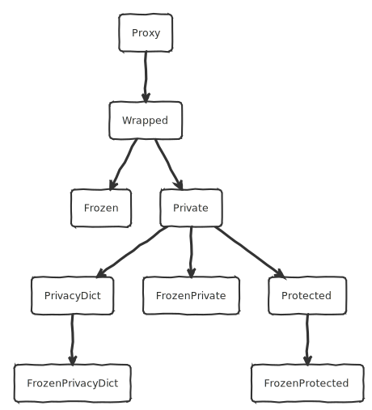

# Restrict visibility or mutability of Python object attributes
pyprotect is a python module that provides API to restrict visibility or mutability of selected Python object attributes in a robust manner.

The key functions in the pyprotect module API - __private()__ and __protect()__ wrap the python object (like a _Proxy_) to restrict visibility or mutability of selected attributes of the wrapped object, while allowing the __wrapping__ object to behave virtually identical to the __wrapped__ object.

## Features
- Can wrap virtually any Python object - instances, classes (types), modules, methods, classmethods, instancemethods, staticmethods, partials, lambdas.
- Tested on Python 2.7 and Python 3.5, 3.6, 3.7, 3.8, 3.9, 3.10, 3.11
- Tested on the following distributions with the latest versions of python2, python3, pypy3, pypy shipped by the respective distributions:
    - Ubuntu Jammy 22.04
    - Arch linux (20220101)
    - Fedora 37
    - Alpine Linux 3.15 (Alpine 3.16 does not have python2-dev)
- Has extensive unit (functional) tests - in [_tests_](https://github.com/sundarnagarajan/python_protected_class/tree/main/tests) directory.

## Table of Contents

<!-- vim-markdown-toc GFM -->

* [Quick start](#quick-start)
* [Classes](#classes)
* [Features of key classes](#features-of-key-classes)
    * [Wrapped](#wrapped)
    * [Frozen](#frozen)
    * [Private](#private)
    * [FrozenPrivate](#frozenprivate)
    * [Protected](#protected)
    * [FrozenProtected](#frozenprotected)
* [API](#api)
    * [Wrapping API](#wrapping-api)
        * [freeze](#freeze)
        * [private](#private-1)
        * [protect](#protect)
        * [wrap](#wrap)
    * [Checking types of wrapped objects](#checking-types-of-wrapped-objects)
        * [isfrozen](#isfrozen)
        * [isimmutable](#isimmutable)
        * [isprivate](#isprivate)
        * [isprotected](#isprotected)
    * [Checking properties of objects inside wrapped objects](#checking-properties-of-objects-inside-wrapped-objects)
        * [contains](#contains)
        * [help_protected](#help_protected)
        * [id_protected](#id_protected)
        * [isinstance_protected](#isinstance_protected)
        * [isreadonly](#isreadonly)
        * [instance_of_protected](#instance_of_protected)
        * [isvisible](#isvisible)
        * [same_class_protected](#same_class_protected)
        * [subclass_of_protected](#subclass_of_protected)
    * [pyprotect module metadata](#pyprotect-module-metadata)
        * [immutable_builtin_attributes](#immutable_builtin_attributes)
        * [always_delegated_attributes](#always_delegated_attributes)
        * [attribute_protected](#attribute_protected)
        * [hidden_pickle_attributes](#hidden_pickle_attributes)
        * [never_writeable](#never_writeable)
        * [never_writeable_private](#never_writeable_private)
* [Calling wrap operations multiple times](#calling-wrap-operations-multiple-times)
* [Python rules for attributes of type 'property':](#python-rules-for-attributes-of-type-property)
* [What kind of python objects can be wrapped?](#what-kind-of-python-objects-can-be-wrapped)
* [Work in progress](#work-in-progress)
* [Changelog](#changelog)
    * [Jan-20-2022](#jan-20-2022)
    * [Jan-15-2022](#jan-15-2022)
    * [Dec-08-2022](#dec-08-2022)

<!-- vim-markdown-toc -->

## Quick start
```python

freeze(o: object) -> Frozen:
```
- If _o_ is immutable (e.g. int , string), returns _o_ UNCHANGED
- If _o_ is Wrapped, returns _o_ UNCHANGED if object WRAPPPED INSIDE _o_ is immutable, returns Frozen otherwise
- If _o_ is Frozen, returns _o_ UNCHANGED
- If _o_ is FrozenPrivate, FrozenProtected or FrozenPrivacyDict, returns _o_ UNCHANGED
- If _o_ is Private, returns FrozenPrivate
- If _o_ is Protected, returns FrozenProtected
- Otherwise, returns Frozen
    
Object returned prevents modification of ANY attribute

```python
private(o: object, frozen: bool = False) -> object:
```
 - If _frozen_ is False:
      - If _o_ is an instance of Private, returns _o_ UNCHANGED
     - If 'o' is an instance of Protected, returns _o_ UNCHANGED
- If _frozen_ is True:
     - If _o_ is an instance of Private, returns _freeze(o)_ (FrozenPrivate)
     - If _o_ is an instance of Protected, returns _freeze(o)_ (FrozenProtected)
     - Otherwise:
          If _frozen_ is True, returns FrozenPrivate; returns Private otherwise

```python
protect(
    o: object frozen: bool = False,
    dynamic: bool = True,
    hide_private: bool = False,
    ro_data: bool = False,
    ro_method: bool = True,
    ro: List[str] = [],
    rw: List[str] = [],
    hide: List[str] = []
) -> object:
# o-->object to be wrapped
```
Returns-->Instance of __FrozenProtected__ if _frozen_; Instance of __Protected__ otherwise

If _protect()_ is called on an object 'o' that is an instance of Protected, _protect()_ will merge the _protect()_ rules, enforcing the most restrictive combination among the two sets of protect() options:
- _hide_ and _hide_private_ are OR-ed
- _ro_method_, _ro_data_ and _ro_ are OR-ed
- _rw_ is AND-ed, but _rw_ of second protect overrides _ro*_ of __second__ protect but __not__ the __first__ protect.
    
In short, by calling protect() a second time (or multiple times):
- Additoinal attributes can be hidden
- Additional attributes can be made read-only
- No previously hidden attribute will become visible
- No previously read-only attribute will become mutable


__Options: protect method arguments__
| Option       | Type        | Default | Description                                                                            | Overrides                  |
|--------------|-------------|---------|----------------------------------------------------------------------------------------|----------------------------|
| frozen       | bool        | False   | If True, no attributes can be changed, added or deleted                                |                            |
| hide_private | bool        | False   | If True, private vars of the form ```_var``` will be hidden                            |                            |
| ro_data      | bool        | False   | Data (non-method) attributes will be immutable<br>Can override selectively with __rw__ |                            |
| ro_method    | bool        | True    | Method (callable) attributes will be immutable<br>Can override selectively with __rw__ |                            |
| ro           | list of str | [ ]      | Attributes that will be immutable<br>Can override selectively with __rw__              |                            |
| rw           | list of str | [ ]      | Attributes that will be mutable                                                        | ro_data<br>ro_method<br>ro |
| hide         | list of str | [ ]   |                                                                                        |                            |

__Visibility and mutability of attributes with protect() method__

| Option       | Attribute Type     | Restricts Visibility | Restricts Mutability |
|--------------|--------------------|-----------------------|----------------------|
| frozen       | Any                | NO                    | YES                  |
| hide_private | Private attributes | YES                   | YES (Indirect)       |
| ro_data      | Data attributes    | NO                    | YES                  |
| ro_method    | Method attributes  | NO                    | YES                  |
| ro           | ANY                | NO                    | YES                  |
| rw           | ANY                | NO                    | YES                  |
| hide         | ANY                | YES                   | YES (Indirect)       |

## Classes



## Features of key classes
### Wrapped
- Visibility: No additional restrictions
- Mutability: No additional restrictions
### Frozen
- Visibility: Does not __additionally__ restrict visibility of any attributes in __wrapped__ object accessed through __wrapping__ object
- Mutability: Prevents modification of ANY attribute
### Private
- Visibility:
    - Cannot access traditionally 'private' mangled python attributes
    - Cannot modify traditionally private attributes (form '_var_')
    - Attributes not part of dir(wrapped_object) are not visible
- Mutability:
    - The following attributes of wrapped object are NEVER writeable:
        ```__class__```, ```__dict__```, ```__delattr__```, ```__setattr__```, ```__slots__```, ```__getattribute__```
    - Traditional (mangled) Python private vars are ALWAYS hidden
    - Private vars (form \_var) will be read-only
    - Attributes cannot be added or removed
    - Attributes that are properties are ALWAYS visible AND WRITABLE (except if '_frozen_' is used)
        - Properties indicate an intention of class author to expose them
        - Whether they are actually writable depends on whether class author implemented property.setter
### FrozenPrivate
- Visibility: Same as Private
- Mutability: Prevents modification of ANY attribute
### Protected
- Features of Private PLUS allows __further restriction__ of:
    - Which attributes are VISIBLE
    - Which attributes are WRITEABLE
- Default settings:
    - Features of Private - see above
    - dynamic == True
        Attribute additions, deletions, type changes automatically visible
    - ro_method == True: Method attributes will be read-only
    - All other non-private data attributes are read-write
### FrozenProtected
- Features of Protected PLUS prevents modification of ANY attribute

## API
### Wrapping API
#### freeze
```python

freeze(o: object) -> Frozen:
```
- If _o_ is immutable (e.g. int , string), returns _o_ UNCHANGED
- If _o_ is Wrapped, returns _o_ UNCHANGED if object WRAPPPED INSIDE _o_ is immutable, returns Frozen otherwise
- If _o_ is Frozen, returns _o_ UNCHANGED
- If _o_ is FrozenPrivate, FrozenProtected or FrozenPrivacyDict, returns _o_ UNCHANGED
- If _o_ is Private, returns FrozenPrivate
- If _o_ is Protected, returns FrozenProtected
- Otherwise, returns Frozen
    
Object returned prevents modification of ANY attribute

#### private
```python
private(o: object, frozen: bool = False) -> object:
```
 - If _frozen_ is False:
      - If _o_ is an instance of Private, returns _o_ UNCHANGED
     - If 'o' is an instance of Protected, returns _o_ UNCHANGED
- If _frozen_ is True:
     - If _o_ is an instance of Private, returns _freeze(o)_ (FrozenPrivate)
     - If _o_ is an instance of Protected, returns _freeze(o)_ (FrozenProtected)
     - Otherwise:
          If _frozen_ is True, returns FrozenPrivate; returns Private otherwise

#### protect
```python
protect(
    o: object frozen: bool = False,
    dynamic: bool = True,
    hide_private: bool = False,
    ro_data: bool = False,
    ro_method: bool = True,
    ro: List[str] = [],
    rw: List[str] = [],
    hide: List[str] = []
) -> object:
# o-->object to be wrapped
```
Returns-->Instance of __FrozenProtected__ if _frozen_; Instance of __Protected__ otherwise

If _protect()_ is called on an object 'o' that is an instance of Protected, _protect()_ will merge the _protect()_ rules, enforcing the most restrictive combination among the two sets of protect() options:
- _hide_ and _hide_private_ are OR-ed
- _ro_method_, _ro_data_ and _ro_ are OR-ed
- _rw_ is AND-ed, but _rw_ of second protect overrides _ro*_ of __second__ protect but __not__ the __first__ protect.
    
In short, by calling protect() a second time (or multiple times):
- Additoinal attributes can be hidden
- Additional attributes can be made read-only
- No previously hidden attribute will become visible
- No previously read-only attribute will become mutable

__Options: protect method arguments__
| Option       | Type        | Default | Description                                                                            | Overrides                  |
|--------------|-------------|---------|----------------------------------------------------------------------------------------|----------------------------|
| frozen       | bool        | False   | If True, no attributes can be changed, added or deleted                                |                            |
| hide_private | bool        | False   | If True, private vars of the form ```_var``` will be hidden                            |                            |
| ro_data      | bool        | False   | Data (non-method) attributes will be immutable<br>Can override selectively with __rw__ |                            |
| ro_method    | bool        | True    | Method (callable) attributes will be immutable<br>Can override selectively with __rw__ |                            |
| ro           | list of str | [ ]      | Attributes that will be immutable<br>Can override selectively with __rw__              |                            |
| rw           | list of str | [ ]      | Attributes that will be mutable                                                        | ro_data<br>ro_method<br>ro |
| hide         | list of str | [ ]   |                                                                                        |                            |

__Visibility and mutability of attributes with protect() method__

| Option       | Attribute Type     | Restricts Visibility | Restricts Mutability |
|--------------|--------------------|-----------------------|----------------------|
| frozen       | Any                | NO                    | YES                  |
| hide_private | Private attributes | YES                   | YES (Indirect)       |
| ro_data      | Data attributes    | NO                    | YES                  |
| ro_method    | Method attributes  | NO                    | YES                  |
| ro           | ANY                | NO                    | YES                  |
| rw           | ANY                | NO                    | YES                  |
| hide         | ANY                | YES                   | YES (Indirect)       |

#### wrap
```python
wrap(o: object) -> Wrapped:
```
- Should behave just like the wrapped object, except following attributes cannot be modified:
    ```__getattribute__```, ```__delattr__```, ```__setattr__```, ```__slots__```
- Explicitly does NOT support pickling, and will raise _pickle.PicklingError_
- Does NOT protect CLASS (or ```__class__```) of wrapped object from modification
- Does NOT protect ```__dict__``` or ```__slots__```
    
Useful for testing if wrapping is failing for a particular type of object

###  Checking types of wrapped objects
#### isfrozen
```python
isfrozen(x: object) -> bool
```
_x_ was created using _freeze()_ or _private(o, frozen=True)_ or _protect(o, frozen=True)_

#### isimmutable
```python
isimmutable(x: object) -> bool
```
_x_ is known to be immutable

#### isprivate
```python
isprivate(x: object) -> bool
```
_x_ was created using _private()_

#### isprotected
```python
isprotected(x: object) -> bool
```
_x_ was created using _protect()_

### Checking properties of objects inside wrapped objects
#### contains
```python
contains(w: object, o: object) -> bool
```
If _w_ is a wrapped object (_iswrapped(w)_ is True), returns whether _w_ wraps _o_
Otherwise unconditionally returns False

#### help_protected
```python
help_protected(x: object) -> None
```
If _x_ wraps _o_, executes _help(o)_
Otherwise executes h_elp(x)_

#### id_protected
```python
id_protected(x: object) -> int
```
if _x_ is a wrapped object (_iswrapped(x)_ is True) and _x_ wraps _o_, returns _id(o)_
Otherwise returns _id(x)_

#### isinstance_protected
```python
isinstance_protected(x: object, t: type) -> bool
```
If _x_ is a wrapped object (_iswrapped(x)_ is True) and _x_ wraps _o_, returns _isinstance(o, t)_
Otherwise returns _isinstance(x, t)_

#### isreadonly
```python
isreadonly(x: object, a: str) -> bool
```
If _x_ is a wrapped object - with _iswrapped(x)_ == True - and _x_ wraps _o_, _isreadonly(x, a)_ returns whether rules of __wrapper__ make attribute _a_ read-only when accessed through _x_
This represents __rule__ of wrapped object - does not guarantee that_o_ has attribute_a_ or that setting attribute _a_ in object _o_ will not raise any exception
If _x_ is __not__ a wrapped object (_iswrapped(x)_ is False) , unconditionally returns False

#### instance_of_protected
```python
instance_of_protected(x: object, o: object) -> bool
```
If _x_ is a wrapped object - with _iswrapped(x)_ == True - and _x_ wraps _o_, _instance_of_protected(x, o)_ returns True if and only if _isinstance(x, type(o))_
If _x_ is not a wrapped object - _iswrapped(x)_ == False - _instance_of_protected(x, o)_ returns _isinstance(x, o)_

#### isvisible
```python
isvisible(x: object, a: str) -> bool
```
Returns False if and only if _iswrapped(x)_ is True AND _x_ makes attribute _a_ invisible if present in wrapped object
<br>
This represents __rule__ of wrapped object - does not guarantee that __wrapped object__ has attribute _a_ or that accessing attribute _a_ in object _x_ will not raise any exception
<br>        
If _x_ is not a wrapped object, unconditionally returns False

#### same_class_protected
```python
same_class_protected(c: type, w: object) -> bool
```
If _iswrapped(w)_ and _w_ wraps _o_: Returns _(c is type(o))_
<br>
Otherwise: returns _(c is type(w))_

#### subclass_of_protected
```python
subclass_of_protected(x: object, w: object) -> bool
```
If _iswrapped(w)_ and _w_ wraps _o_: Returns _issubclass(x, type(o))_
<br>
Otherwise: returns _issubclass(x, w)_

### pyprotect module metadata
#### immutable_builtin_attributes
```python
immutable_builtin_attributes() -> Set[str]
```
Returns-->set of str: attributes in builtins that are immutable
Used in unit tests

#### always_delegated_attributes
```python
always_delegated_attributes() -> set(str)
```
Attributes that are always delegated to wrapped object

#### attribute_protected
```python
attribute_protected() -> str
```
Name of special attribute in Wrapped objects

#### hidden_pickle_attributes
```python
hidden_pickle_attributes() -> set(str)
```
Attributes that are never visible in object 'o' if iswrapped(o) - to disallow pickling

#### never_writeable
```python
never_writeable() -> set(str)
```
Attributes that are never writeable in object _o_ if _iswrapped(o)_

#### never_writeable_private
```python
never_writeable_private() -> set(str)
```
Attributes that are never writeable in object _o_ if _isprivate(o)_

## Calling wrap operations multiple times

In the table below:
- The left-most column shows starting state.
- The top row shows operation applied to the starting state.
- The intersecting cell shows the result.
- _UNCH_ represents operation returning the starting state unchanged

| Operation  🡆<br>On type 🡇 | wrap       | freeze          | private       | private<br>+ frozen | protect                | protect<br>+ frozen    |
|---------------------------|------------|-----------------|---------------|---------------------|------------------------|------------------------|
| Ordinary object<br>_iswrapped(x)_ is False                   | Wrapped       | Frozen<br>(2)       | Private       | FrozenPrivate       | Protected              | FrozenProtected        |
| Wrapped                   | UNCH       | Frozen<br>(2)       | Private       | FrozenPrivate       | Protected              | FrozenProtected        |
| Frozen                    | Wrapped<br>(2) | UNCH<br>(2)     | FrozenPrivate | FrozenPrivate       | FrozenProtected        | FrozenProtected        |
| Private                   | UNCH       | FrozenPrivate   | UNCH          | FrozenPrivate       | Protected              | FrozenProtected        |
| FrozenPrivate             | UNCH       | UNCH            | UNCH          | UNCH                | FrozenProtected        | FrozenProtected        |
| Protected                 | UNCH       | FrozenProtected | UNCH          | FrozenProtected     | Protected<br>(1)           | FrozenProtected<br>(1)     |
| FrozenProtected           | UNCH       | UNCH            | UNCH          | UNCH                | FrozenProtected<br>(1) | FrozenProtected<br>(1) |

1. _protect()_ applied twice will merge the _protect()_ rules, enforcing the most restrictive combination among the two sets of protect() options:
- _hide_ and _hide_private_ are OR-ed
- _ro_method_, _ro_data_ and _ro_ are OR-ed
- _rw_ is AND-ed, but _rw_ of second protect overrides _ro*_ of __second__ protect but __not__ the __first__ protect.
    
In short, by calling protect() a second time (or multiple times):
    - Additoinal attributes can be hidden
    - Additional attributes can be made read-only
but:
    - No previously hidden attribute will become visible
    - No previously read-only attribute will become mutable

2. If _x_ is an immutable object (e.g. int, str ...) having _isimmutable(x) \=\= True_, _freeze(x)_ returns _x_ and _iswrapped(freeze(x))_ will be False.
    
For all other objects _x_, having _isimmutable(x) \=\= False_, _freeze(x)_ will return a Frozen object having _iswrapped(freeze(x)) == True_
    
For all other wrapped objects _w_, created with _private(x)_ or _protect(x)_, _freeze(w)_ will always return a Wrapped object with _iswrapped(w) == True_

## Python rules for attributes of type 'property':
- Properties are defined in the CLASS, and cannot be changed in the object INSTANCE
- Properties cannot be DELETED
- Properties cannot be WRITTEN to unless property has a 'setter' method defined in the CLASS
- These rules are implemented by the python language (interpreter) and Protected class does not enforce or check

## What kind of python objects can be wrapped?
Pretty much anything. pyprotect only mediates attribute access using ```object.__getattribute__```, ```object.__setattr__``` and ```object.__delatr__```. If these methods work on your object, your object can be wrapped

## Work in progress
- Uploading to pypi.org
- [Test cases required](https://github.com/sundarnagarajan/python_protected_class/issues?q=is%3Aopen+is%3Aissue+label%3ATests)

## Changelog
### Jan-20-2022
- Project name on github changed to ```pyprotect``` to match the name of the module. This has been long-pending. The [old github link](https://github.com/sundarnagarajan/python_protected_class) redirects to the new project name. 
### Jan-15-2022
- Started signing commits with my GPG key and displaying 'verified' for signed commits
### Dec-08-2022
A number of parameters to protect() have been discontinued. See list and reasons below, as well as how to achieve the same effect without thos parameters (sometimes, it takes more work). Most of them would be realistically useful very rarely, and / or do not align with what I call 'idiomatic python'.

**hide_all, hide_method, hide_dunder**
So-called 'special methods' in Python serve an important functional roles - especially in emulating containers (tuples, lists, sets, dicts), emulating numeric types supporting arithmetic operators, numeric comparisons etc. If such specific 'dunder methods' were hidden, it would definitely affect the behavior of the wrapped object. ```hide_dunder``` would hide all such special methods. ```hide_method``` would in addition hide all methods in the objest. ```hide_all``` would hide all object attributes, making the object virtually useless, and the option useful in testing (if at all).

**hide_data**
In most cases, hiding all non-method data attributes will make the object less useful / cripple the expected usage of the object. Specific use-cases can be achieved using the 'hide' parameter.

**ro_dunder**
Seems like it can be replaced by using ro_method' Mostly, in 'idiomatic python', methods of a class / instance are not mutated from outside the class / instance. This expected 'idiomatic python' behavior can be achieved with 'ro_method'.

**ro_all**
Is unnecessary, since 'frozen' can be used instead.

**add**
In my opinion, 'add' does not align with 'idiomatic python'. While Python allows users of a class / instance adding attributes to the class / instance, that is not the expected style. Based on this, I have decided to promote that 'idiomatic style', and prevent adding / deleting any attributes in a Private or Protected object.

**show**
It is unnecessary, since all attributes are visible by default in Python. Only 'hide' or 'hide_private' will hide any attributes.

This leaves the following (incidentally also reducing testing load):

	- Visibility:
		- hide_private
		- hide
	- Mutability:
		- ro_data
		- ro_method
		- ro
		- rw
		- frozen
	- Behavior:
		- dynamic

